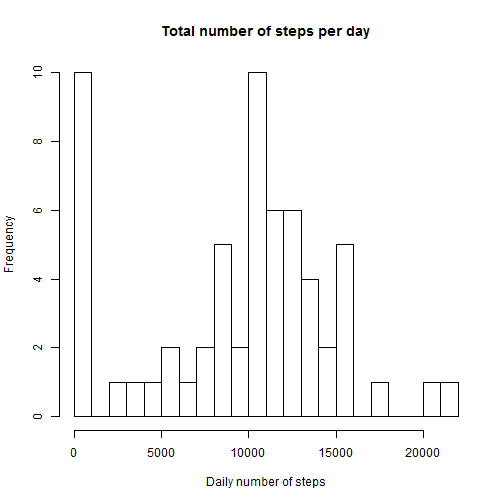
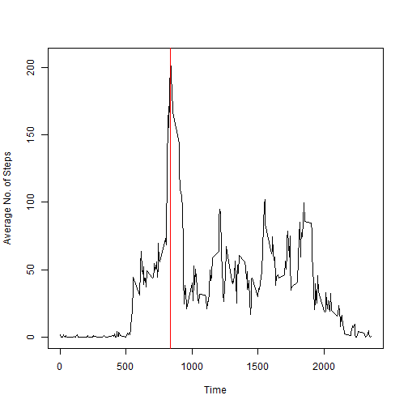
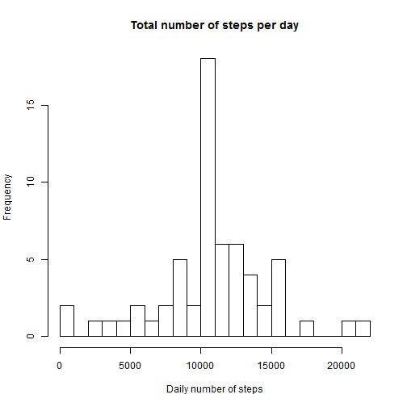
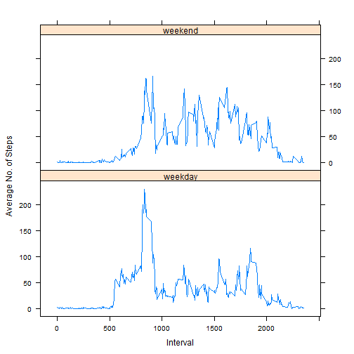

## Introduction

It is now possible to collect a large amount of data about personal
movement using activity monitoring devices such as a
[Fitbit](http://www.fitbit.com), [Nike
Fuelband](http://www.nike.com/us/en_us/c/nikeplus-fuelband), or
[Jawbone Up](https://jawbone.com/up). These type of devices are part of
the "quantified self" movement -- a group of enthusiasts who take
measurements about themselves regularly to improve their health, to
find patterns in their behavior, or because they are tech geeks. But
these data remain under-utilized both because the raw data are hard to
obtain and there is a lack of statistical methods and software for
processing and interpreting the data.

The data are from a personal activity monitoring
device. This device collects data at 5 minute intervals through out the
day. The data consists of two months of data from an anonymous
individual collected during the months of October and November, 2012
and include the number of steps taken in 5 minute intervals each day.

  
## Loading and preprocessing the data

The variables included in this dataset are:

* **steps**: Number of steps taking in a 5-minute interval (missing
    values are coded as `NA`)

* **date**: The date on which the measurement was taken in YYYY-MM-DD
    format

* **interval**: Identifier for the 5-minute interval in which
    measurement was taken

The dataset is stored in a comma-separated-value (CSV) file and there
are a total of 17,568 observations in this
dataset.

The dataset file `activity.csv` needs to be placed in the working directory, before being loaded.

The code below loads the dataset and transforms it into a *dplyr* table (*tbl_df*):


```r
data <- read.csv("activity.csv")
library(dplyr)
data <- tbl_df(data)
```

If the *dplyr* has not been previously installed, it should be installed with the following line code:


```r
install.packages("dplyr")
```
## What is mean total number of steps taken per day?

In order to calculate the mean and median of the total number of steps per day, first the data need to be subset per date and the total number of steps per day calculated for each date:


```r
steps_perday <- 
  data %>%
  group_by(date) %>%
  summarise(TotSteps = sum(steps,na.rm=T))

steps_perday
```

```
## Source: local data frame [61 x 2]
## 
##          date TotSteps
## 1  2012-10-01        0
## 2  2012-10-02      126
## 3  2012-10-03    11352
## 4  2012-10-04    12116
## 5  2012-10-05    13294
## 6  2012-10-06    15420
## 7  2012-10-07    11015
## 8  2012-10-08        0
## 9  2012-10-09    12811
## 10 2012-10-10     9900
## ..        ...      ...
```

To visualize the data above we can plot a histogram of the total number of steps per day:


```r
hist(steps_perday$TotSteps, main="Total number of steps per day", xlab='Daily number of steps', breaks=20)
```

 

And the **mean** value and **median** of the total number of steps per day are easily calculated:


```r
mean(steps_perday$TotSteps)
```

```
## [1] 9354.23
```

```r
median(steps_perday$TotSteps)
```

```
## [1] 10395
```

## What is the average daily activity pattern?

With the following code we can build and plot the average steps taken at each 5 minute interval averaged across all days and determine the time interval which contains the maximum number of steps:


```r
avrg_perInterv <- 
  data %>%
  group_by(interval) %>%
  summarise(AvrgSteps = mean(steps,na.rm=T))

with(avrg_perInterv, {
  plot(interval,AvrgSteps, type="l", xlab="Time", ylab="Average No. of Steps")
  abline(v=interval[AvrgSteps == max(AvrgSteps)], col="red")
})
```

 

The time interval which contains the maximum number of steps is:


```r
with(avrg_perInterv, {
  interval[AvrgSteps == max(AvrgSteps)]
})
```

```
## [1] 835
```

## Imputing missing values

There are a number of days/intervals where there are missing values (coded as NA). The presence of missing days may introduce bias into some calculations or summaries of the data.

The total count of missing values in the dataset is as follows:


```r
sum(is.na(data$steps))
```

```
## [1] 2304
```
With the following code a new dataset equal to the original one is created, but with all missing values replaced with the mean for the 5-minute interval where the value was missing:


```r
data_m <- data
for (i in 1:length(data_m$interval)) {
  if(is.na(data_m$steps[i])) {
    data_m$steps[i] <- avrg_perInterv$AvrgSteps[avrg_perInterv$interval == data_m$interval[i]]
  }
}
```

With the new dataset a new histogram of the total number of steps per day is plotted:


```r
steps_perday_m <- 
  data_m %>%
  group_by(date) %>%
  summarise(TotSteps = sum(steps,na.rm=T))

hist(steps_perday_m$TotSteps, main="Total number of steps per day", xlab='Daily number of steps', breaks=20)
```

 

And, as done before, the mean and the median of the total number of steps per day are calculated:


```r
mean(steps_perday_m$TotSteps)
```

```
## [1] 10766.19
```

```r
median(steps_perday_m$TotSteps)
```

```
## [1] 10766.19
```

Replacing missing data with the mean of the steps for each interval gives more plausible results and the mean and median are now equal. Instead, when the missing values `NA` were simply ignored, they were accounted as zeros, as clearly visible comparing the first bar on the left of the plotted histograms.

## Are there differences in activity patterns between weekdays and weekends?

A new factor variable is created in the latter dataset with two levels -- "weekday" and "weekend" indicating whether a given date is a weekday or weekend day.


```r
data_m <- mutate(data_m, Day = "weekend")
data_m$Day[(as.POSIXlt(data_m$date)$wday >= 1 & as.POSIXlt(data_m$date)$wday <= 5)] <- "weekday"
```

We then make a panel plot containing a time series plot of the 5-minute interval (x-axis) and the average number of steps taken, averaged across all weekday days or weekend days (y-axis). The code is as follows:


```r
steps_wday <- 
  data_m %>%
  group_by(interval,Day) %>%
  summarise(AvrgSteps_wday = mean(steps))

library(lattice)
xyplot(AvrgSteps_wday ~ interval | Day, steps_wday, layout = c(1,2), type='l', ylab="Average No. of Steps", xlab="Interval")
```

 

Note: the graphic package *lattice* may need to be installed, prior to running the code above.


```r
install.packages("lattice")
```
